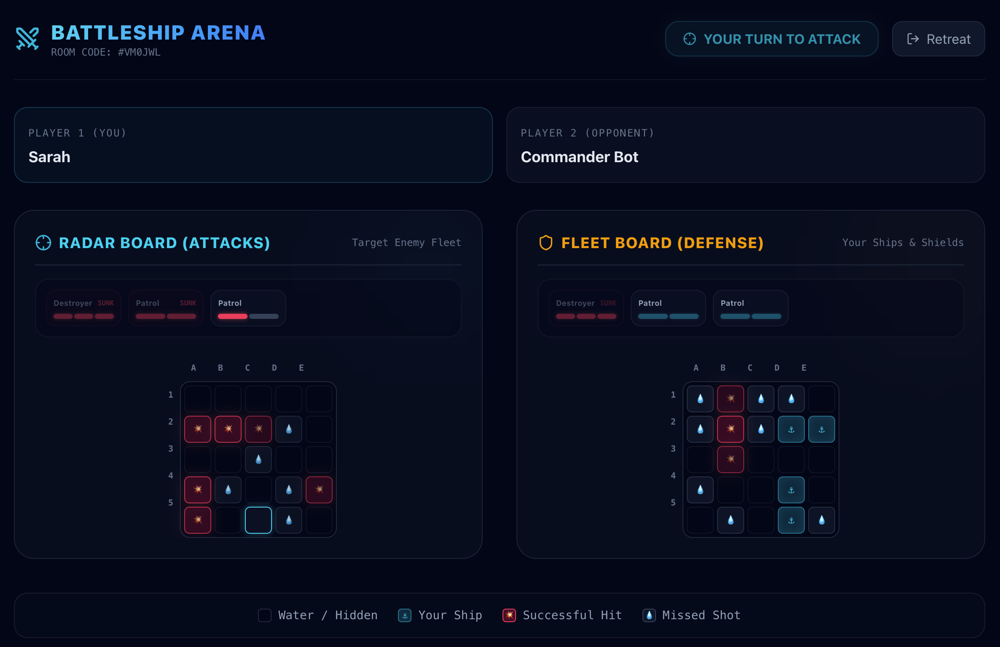

# Battleship Arena - Real-Time Multiplayer Game



**Battleship Arena** is a real-time, multiplayer naval warfare web application where players secretively position their fleet grids and take turns striking the opponent's coordinates. In addition to the classic multiplayer modes, the game features a dedicated offline Battle vs Computer (AI) mode.

---

## 🚀 Core Features

- **Real-Time Multiplayer (WebSocket)**: Seamless turns and status synchronization using `Socket.io` connection channels.
- **Smart Computer (AI) Opponent**: Play solo against a smart hunting-targeting AI that strategically targets coordinates adjacent to hits on partially damaged ships, falling back to random empty cells otherwise.
- **Flexible Grid & Fleet Configurations**: 
  - **10x10 Classic Mode**: Place and protect all 4 fleet ships (Carrier, Battleship, Destroyer, Patrol Boat).
  - **5x5 Quick Match**: A fast-paced match with custom fleet requirements (minimum of 2 ships required to lock in).
- **Custom SweetAlert2 Popups**: Matches a premium dark sci-fi aesthetic, giving visual confirmations and forfeiting alerts upon clicking retreat.
- **Global Leaderboard & Stats Profile**: Wins, losses, and game ratios persisted in MongoDB and updated after every match.
- **Automatic Forfeit Winner on Disconnect**: Instantly awards wins to the remaining player if their opponent disconnects or closes their browser tab.

---

## 🛠️ Tech Stack

### **Frontend**:
- **Framework**: React 19 (compiled with Vite)
- **Styling**: Vanilla CSS & Tailwind CSS (Custom Dark Futuristic Theme)
- **Notification Widgets**: SweetAlert2 & React-Toastify
- **Communication**: Socket.io-client & Axios
- **Icon Assets**: Lucide React

### **Backend**:
- **Runtime**: Node.js & Express
- **WebSocket Protocol**: Socket.io
- **Database Engine**: MongoDB (configured via Mongoose ORM)

---

## 📂 Project Directory Structure

```text
├── backend/
│   ├── src/
│   │   ├── config/          # Database connection
│   │   ├── controllers/     # Express route handlers (users, game sessions)
│   │   ├── models/          # Mongoose database models (User, GameSession, GameState)
│   │   ├── routes/          # Express route definitions
│   │   ├── sockets/         # WebSocket events and disconnection handling
│   │   ├── utils/           # Fleet coordinate validators and AI algorithms
│   │   ├── app.js           # Express app setups with preflight CORS handling
│   │   └── server.js        # Node.js http server initialization
│   ├── vercel.json          # Express routing configuration for Vercel Serverless
│   └── package.json         # Server dependencies and development scripts
│
├── frontend/
│   ├── public/              # Static public directory (including _redirects for Netlify)
│   ├── src/
│   │   ├── api/             # Base Axios configuration
│   │   ├── assets/          # Static images and banners
│   │   ├── context/         # React Context for User Session management
│   │   ├── pages/           # Views (NamePage, LobbyPage, ShipPlacementPage, GamePage, RulesPage)
│   │   ├── routes/          # React Router client-side path definitions (AppRoutes)
│   │   └── services/        # Service layers communicating with the backend API
│   ├── package.json         # Client dependencies and build scripts
│   └── vite.config.js       # Vite client compiler configurations
```

---

## 💻 Local Installation and Setup

Follow these steps to run the game instances locally:

### 1. Clone Repository
```bash
git clone <repository_url>
cd "Battleship Multiplayer Web App"
```

### 2. Run Backend API Server
```bash
cd backend
npm install
npm run dev
```
The server will run on `http://localhost:4000`.

### 3. Run Frontend Client
```bash
cd ../frontend
npm install
npm run dev
```
The client will spin up on `http://localhost:5173`. Open your browser to begin playing!

---

## ⚙️ Environment Variables

### **Backend Config (.env)**
Create a `.env` file in the `backend/` directory:
```env
PORT=4000
MONGODB_URI=your_mongodb_connection_string
```

### **Frontend Config (.env)**
Create a `.env` file in the `frontend/` directory:
```env
VITE_API_URL=http://localhost:4000/api
```

---

## 🚀 Production Deployment

### **Backend (Vercel)**
1. Navigate to the folder: `cd backend`
2. Run development deployment: `vercel`
3. Push to production: `vercel --prod`
4. Set the **`MONGODB_URI`** environment variable in your Vercel Dashboard Settings.

### **Frontend (Netlify)**
1. Go to the frontend folder and compile the build:
   ```bash
   cd frontend
   npm run build
   ```
2. Drag and drop the resulting `frontend/dist/` folder onto [Netlify Drop](https://app.netlify.com/drop).
3. The routing redirects config is already set in `frontend/public/_redirects` to avoid any client routing refresh errors.
